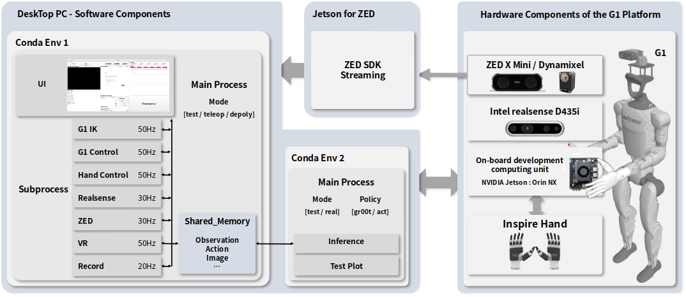
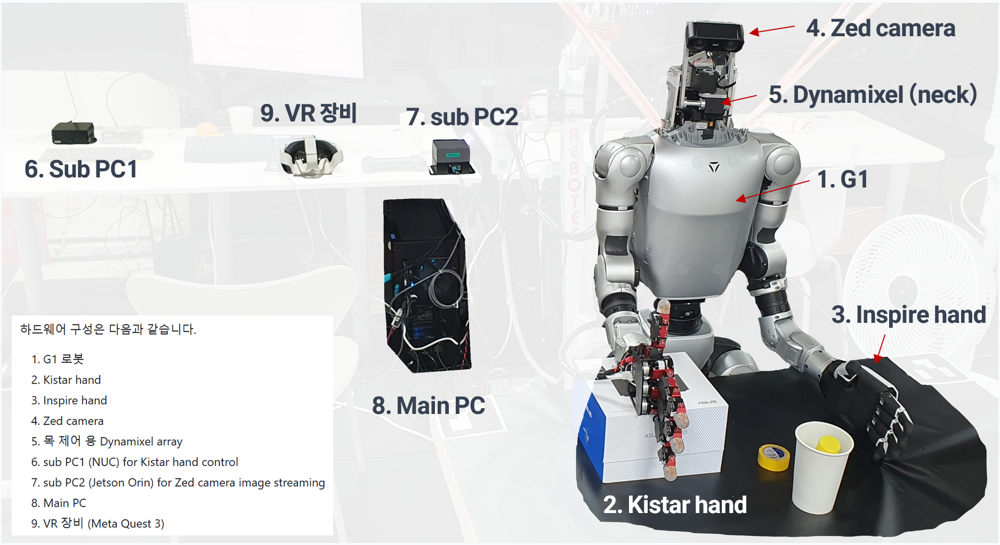
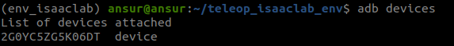
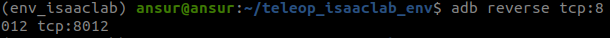

# G1_teleoperation

Unitree **G1** 및 손 (Inspire hand 및 Kistar hand)이 통합된 휴머노이드 시스템을 원격 조작(teleop)하고, **센서/카메라/관절/촉각 데이터를 에피소드 단위로 기록·재생**하며 **모방학습(Deploy)** 워크플로우까지 아우르는 **통합 UI**입니다.

> 이 문서는 설치부터 하드웨어/소프트웨어 설정, 실행 방법과 문제 해결(Troubleshooting)까지 한 번에 다룹니다.

---

## 목차

* [개요](#개요)

> 각 하드웨어 환경 설치 과정
* [1-1. Main 환경 설치(Conda Env #1: teleop)](#1-1-main-환경-설치conda-env-1-teleop)
* [1-2. Main 환경 설치(Conda Env #2: gr00t)](#1-2-main-환경-설치conda-env-2-gr00t)
* [1-3. Sub 하드웨어 환경 설치](#1-3-sub-하드웨어-환경-설치)

> 실 사용 전 각 하드웨어 간 연결 및 세팅 과정
* [2-1. 하드웨어간 연결](#2-1-하드웨어간-연결)
* [2-2. Sub PC 실사용 전 세팅](#2-2-sub-pc-실사용-전-세팅)

> 실 사용 과정
* [3-1. Tele operation (데이터 수집)](#3-1-tele-operation-데이터-수집)
* [연구단 데이터 현황 공유 시트](#연구단-데이터-현황-공유-시트)
* [3-2. 데이터 정제 과정](#3-2-데이터-정제-과정)
* [3-3. Policy (gr00t) 학습 과정](#3-3-policy-gr00t-학습-과정)
* [3-4. Policy (gr00t) deploy](#3-4-policy-gr00t-deploy)

> 기타
* [라이선스 & 감사](#라이선스--감사)

---

## 개요

### 핵심 기술

* **GUI 기반 Teleoperation**: G1을 원격 조작하며 **센서·카메라·관절·촉각**을 **에피소드 단위**로 **기록/재생**.
* **모방학습 Deploy**까지 이어지는 데이터 파이프라인을 염두에 둔 설계.

### 주요 구성(아키텍처)



하드웨어 구성은 다음과 같습니다.



1. G1 로봇 
2. Kistar hand
3. Inspire hand
4. Zed camera
5. 목 제어 용 Dynamixel array
6. sub PC1 (NUC) for Kistar hand control
7. sub PC2 (Jetson Orin) for Zed camera image streaming
8. Main PC
9. VR 장비 (Meta Quest 3)

---
---
---

## 1-1. Main 환경 설치(Conda Env #1: `teleop`)

Main PC 에서 로봇 제어를 총괄할 환경입니다.
원격 조작 및 데이터 수집, policy deploy 모두에서 활용됩니다.

> 환경 설치 전, 아래 링크 내용을 참고하셔서 conda-forge 설정을 완료하시고, 진행해주세요.

https://talkingpersoncom.wordpress.com/2023/11/08/miniconda-conda-forge-%ec%84%a4%ec%b9%98/

> Python **3.8** 권장

```bash
conda create -n teleop python=3.8 -y
conda activate teleop
python -m pip install --upgrade pip wheel setuptools
```

### 1) ZED SDK & Python API

1. ZED SDK 설치: [https://www.stereolabs.com/en-kr/developers/release](https://www.stereolabs.com/en-kr/developers/release)
2. Python API 설치(기본 설치 경로 기준 `/usr/local/zed`):

   ```bash
   python /usr/local/zed/get_python_api.py
   ```

### 2) 필수 리포지토리/바이너리 클론

작업 공간으로 이동 후 다음을 클론합니다.

```bash
# Unitree SDK (Python)
git clone https://github.com/unitreerobotics/unitree_sdk2_python.git

# Dynamixel SDK
git clone https://github.com/ROBOTIS-GIT/DynamixelSDK.git

# Inspire hand
git clone https://github.com/NaCl-1374/inspire_hand_ws.git
# => inspire_hand_ws 내 PyQt 관련 설치 루틴을 제거한 뒤 설치하세요.
```

### 3) 역기구학( **Pinocchio** )

```bash
conda install -c conda-forge pinocchio=3.2.0 -y
```

### 4) PyQt5

```bash
conda install -c conda-forge \
  pyqt=5.15.9 pyqt5-sip=12.12.2 pyqtwebengine=5.15.9
```

### 5) 기타 의존성(프로젝트 루트에서)

```bash
pip install -e ".[all]"
```

---

## 1-2. Main 환경 설치(Conda Env #2: `gr00t`)

Main PC에서 학습한 GR00T policy를 deploy하는 환경입니다.
원격 조작 및 데이터 수집 상황에서는 활용하지 않습니다.

### NVIDIA Isaac **GR00T**

```bash
git clone https://github.com/NVIDIA/Isaac-GR00T
cd Isaac-GR00T
```

> **CUDA 12.4** 권장(특히 `flash-attn` 모듈 구성 시 호환성 이슈 방지)

```bash
conda create -n gr00t python=3.10 -y
conda activate gr00t
pip install --upgrade setuptools
pip install -e .[base]
pip install --no-build-isolation flash-attn==2.7.1.post4
```

### ACT

```bash
git clone https://github.com/tonyzhaozh/act.git
cd act

pip install torchvision
pip install torch
pip install pyquaternion
pip install pyyaml
pip install rospkg
pip install pexpect
pip install mujoco==2.3.7
pip install dm_control==1.0.14
pip install opencv-python
pip install matplotlib
pip install einops
pip install packaging
pip install h5py
pip install ipython
cd act/detr && pip install -e .
```

---

## 1-3. Sub 하드웨어 환경 설치

이 섹션에서는 Main 환경 외에 다른 장치에서 필요한 환경 설치 절차를 설명합니다.

### 환경 설치 필요 장비

*   sub PC1 : RT 패치 완료된 Ubuntu 환경에 코드 설정
*   sub PC2 : Zed 카메라 데이터 수집이 가능한 미니 PC에 SDK 설치
*   VR 장비 : Meta quest SDK 설치 필요

### 1) sub PC1 -> Kistar hand control PC

해당 PC는 RT(Real-time) 커널 패치가 완료되어 이더캣 통신이 가능한 PC가 필요합니다.
현재 Kistar hand와 Pair를 이루어 hand 제어가 가능한 PC를 사용하도록 합니다.
해당 PC에서의 구동 code는 본 repository의 kistar_hand_control 폴더에 있는 코드를 활용해 주세요.

### 2) sub PC2 -> Zed 카메라 스트리밍용 orin 설정

하단 내용을 바탕으로 스트리밍 환경을 설정해주세요.

* Orin AGX에서  소프트웨어 설정 가이드: [https://www.stereolabs.com/docs/embedded/zed-link/dual-jetson-orin-agx-devkit-setup](https://www.stereolabs.com/docs/embedded/zed-link/dual-jetson-orin-agx-devkit-setup)

  * ZED Link Driver 설치: [https://www.stereolabs.com/docs/embedded/zed-link/install-the-drivers](https://www.stereolabs.com/docs/embedded/zed-link/install-the-drivers)
  * Jetson용 ZED SDK 설치: [https://www.stereolabs.com/docs/development/zed-sdk/jetson](https://www.stereolabs.com/docs/development/zed-sdk/jetson)

### 3) VR 장비 -> Zed 카메라 스트리밍

하단 내용을 바탕으로 VR 기기 설정을 수행해주세요. 연결 부분은 후술할 사용 방법에서 더 자세히 기술합니다.

#### VR Setup (Baseline)

* [https://github.com/OpenTeleVision/TeleVision](https://github.com/OpenTeleVision/TeleVision)
* [https://github.com/unitreerobotics/xr\_teleoperate](https://github.com/unitreerobotics/xr_teleoperate)

#### Connect VR (로컬 스트리밍)

* [https://github.com/OpenTeleVision/TeleVision](https://github.com/OpenTeleVision/TeleVision) — *Local streaming* 섹션 참고
* 참고 글: *How to easily test your WebVR/WebXR locally on Oculus Quest*

1. Quest 개발자 모드 설정: [https://developer.oculus.com/documentation/native/android/mobile-device-setup/](https://developer.oculus.com/documentation/native/android/mobile-device-setup/)
2. Android SDK Platform Tools 설치
3. USB로 Quest 연결 후 확인

```bash
adb devices
```

> 예시 스크린샷: 

4. 포트 포워딩 활성화

> 예시 스크린샷: 

#### Pose 데이터 획득

* VUER Docs(Hand Tracking): [https://docs.vuer.ai/en/latest/examples/19\_hand\_tracking.html](https://docs.vuer.ai/en/latest/examples/19_hand_tracking.html)
* 참고 구현: [https://github.com/silencht/televuer/tree/34f4475fca12166d2c52f2469385a851f614fd4e](https://github.com/silencht/televuer/tree/34f4475fca12166d2c52f2469385a851f614fd4e)

---
---
---

## 2-1. 하드웨어간 연결

이 섹션에서는 모든 하드웨어의 환경 설치가 완료된 이후, 데이터 수집 및 Deploy를 위한 하드웨어 준비 및 연결 과정에 대해 설명합니다.

필요 연결은 다음과 같습니다.

1. Main PC <-> G1 로봇 : G1 부팅 후 디버깅 모드 진입, 이후 lan 연결 및 IP 설정
2. sub PC1 (NUC) <-> Kistar hand : RT 패치된 랜포트에 lan 연결
3. sub PC1 <-> Main PC : lan 연결 후 해당 포트 IP 설정
4. sub PC2 <-> Zed 카메라 : 카메라 케이블 연결 (카메라 재연결시 마다 PC2 reboot 필요)
5. sub PC2 <-> Main PC : lan 연결 후 해당 포트 IP 설정
6. Dynamixel <-> Main PC : USB cable 연결
7. Main PC <-> VR 장비 : USB cable 연결

### 1. Main PC <-> G1 로봇

1.  **PC 연결 (유선 LAN)**: Unitree G1의 전원을 켜고, 메인 PC와 이더넷 케이블로 연결합니다.

2.  **G1 부팅 및 디버깅 모드 진입**:
    a. G1의 전원을 켜고 초기화가 완료될 때까지 약 1분간 대기합니다.
    b. 리모컨으로 `L2 + R2`를 동시에 누른 상태에서, `L2 + A`를 눌러 로봇이 초기 자세로 이동하는지 확인합니다.
    c. `L2 + B`를 눌러 원래 자세로 돌아옵니다. 이 과정을 통해 G1이 SDK 통신이 가능한 디버깅 모드로 전환됩니다. `L2 + B`를 한번 누르면 damping 모드로, 한번 더 누르면 zero damping 모드로 들어갑니다.
    커맨드를 입력하였을 때 리모컨의 진동이 발생하지 않는다면 리모컨이 켜져있는지 확인해주세요.
    `L2 + A`가 먹히지 않는다면, 아직 부팅이 완료되지 않은 것으로 조금 더 기다린 후 `L2 + R2`부터 다시 시도해주세요.
 
3.  **네트워크 설정**: 메인 PC에서 G1과 연결된 이더넷 포트의 네트워크 설정을 확인합니다.

    a. 메인 PC에서, G1과 연결된 이더넷 포트의 IP를 **192.168.123.162** 로 설정해 주어야 합니다.
    (IPv4 : **192.168.123.162** / Netmask: **255.255.255.0**, Gateway: **192.168.123.1**)

4.  **LAN 설정 파일 수정**:
    > ⚠️ **[중요]** Main PC와 G1이 연결된 이더넷 네트워크 인터페이스 이름(예: `enp3s0`)에 맞게 `./utils/lan_config.yaml` 파일을 수정해야 합니다.

### 3. sub PC1 <-> Main PC

1.  **PC 연결**: ASUS NUC(Sub PC1)의 위쪽 LAN 포트와 메인 PC를 이더넷 케이블로 연결합니다.
    > 💡 **[참고]** NUC의 RT커널 패치된 LAN 포트는 Kistar Hand와의 통신에 사용합니다 (연결 2. 과정).

2.  **네트워크 설정**: 메인 PC에서 Sub PC1과 연결된 이더넷 포트의 네트워크 설정을 확인합니다.

    a. 메인 PC에서, sub PC1와 연결된 이더넷 포트의 IP를 **192.168.6.11** 로 설정해 주어야 합니다.
    (IPv4 : **192.168.6.11** / Netmask: **255.255.255.0**, Gateway: **192.168.6.1**)

    b. Sub PC1에서, 메인 PC와 연결된 이더넷 포트의 IP를 **192.168.6.10** 로 설정해 주어야 합니다.
    (IPv4 : **192.168.6.10** / Netmask: **255.255.255.0**, Gateway: **192.168.6.1**)

### 5. sub PC2 <-> Main PC 

1.  **PC 연결**: 'USB-C to Ethernet' 케이블을 사용하여 Jetson Orin (Sub PC2)과 메인 PC의 Thunderbolt 포트를 연결합니다.

2.  **네트워크 설정**: 메인 PC에서 Sub PC2와 연결된 이더넷 포트의 네트워크 설정을 확인합니다.

    a. 메인 PC에서, sub PC2와 연결된 이더넷 포트의 IP를 **192.168.5.12** 로 설정해 주어야 합니다.
    (IPv4 : **192.168.5.12** / Netmask: **255.255.255.0**, Gateway: **192.168.5.1**)

    b. Sub PC2에서, 메인 PC와 연결된 이더넷 포트의 IP를 **192.168.5.11** 로 설정해 주어야 합니다.
    (IPv4 : **192.168.5.11** / Netmask: **255.255.255.0**, Gateway: **192.168.5.1**)


### 연결 확인

네트워크 연결 상태를 확인하려면 다음 명령어를 사용하세요:

```bash
ping 192.168.123.162
```
> **참고:** 각 디바이스의 IP 주소로 ping 테스트를 수행하여 연결 상태를 확인할 수 있습니다.

---

## 2-2. Sub PC 실사용 전 세팅

이 섹션에서는 모든 하드웨어의 환경 설치 및 연결이 완료 된 후, Main PC에서 데이터 수집 및 Deploy를 수행하기 전 각 Sub PC에서 수행되어야 하는 준비 과정을 설명합니다.

필요 세팅은 다음과 같습니다.

1. sub PC1 : Main PC 통신 코드 실행 및 Kistar hand 제어 코드 실행
2. sub PC2 : Main PC에서 ssh 접속 후 스트리밍 코드 실행

### 1. sub PC1 (kistar hand 제어 용) 세팅

1.  **EtherCAT 통신 활성화**
    ```bash
    # (ASUS NUC) EtherCAT 통신 시작
    sudo ethercatctl start

    # (ASUS NUC) 통신 상태 확인
    sudo ethercatctl status
    ```

2. **Main PC와의 통신 코드 실행 (터미널 1)**

    > code_for_kistar_control 폴더의 압축파일을 해제하고, 해당 파일 내부의 code를 sub PC1에서 활용합니다.

    ```bash
    # (ASUS NUC) Kistar_hand_Controller 디렉토리로 이동
    cd Kistar_hand_Controller

    # (ASUS NUC) Kistar Hand 컨트롤러 프로세스 실행
    python3 robot_controller/kistar_hand_controller_process.py
    ```

3.  **Kistar Hand 제어 코드 실행 (터미널 2)**
    ```bash
    # (ASUS NUC) 빌드 디렉토리로 이동
    cd Kistar_hand_Controller/kistar_ctrl_v2/build

    # (ASUS NUC) 드라이버 실행
    sudo ./kistar_ctrl_v2
    ```
    *   **성공 확인**: Kistar Hand가 초기 자세(모두 펴진 상태)로 움직이고, 터미널 2에 `cnt` 값이 계속 증가하면 정상적으로 실행된 것입니다.

### 2. sub PC2 (Zed 카메라 스트리밍 용) 세팅

1.  **SSH 접속**: 메인 PC의 터미널에서 아래 명령어를 입력하여 Jetson Orin에 접속합니다.
    ```bash
    ssh swabbot@192.168.5.11
    ```
    *   비밀번호: `1`

    *   해당 접속에 실패했다면, 이더넷 포트와 IP 설정이 맞지 않는 것으로, 해당 부분을 확인하고 수정 후 재시도 합니다.

2.  **ZED 프로그램 실행**: SSH로 접속된 Jetson 터미널에서 다음 명령어를 실행합니다.
    ```bash
    # Television 환경 (conda) 실행
    tv
    ```
    ```bash
    # ZED 카메라 데이터 송신 프로그램 실행
    zed_sender
    ```    

> ⚠️ **[중요]** 반드시 ZED 카메라를 **먼저 연결한 후** Jetson Orin의 전원을 켜야 합니다. 만약 Jetson 부팅 후 카메라를 연결했다면, 아래 명령어로 재부팅하세요.
> ```bash
> # (ssh 연결된 Jetson 터미널 (Main PC 터미널이 아닙니다!!))
> sudo reboot
> ```

---
---
---

## 3-1. Tele operation (데이터 수집)

이 섹션에서는 사용 가능한 원격 조종 모드와 데이터 수집 절차를 설명합니다.
각 원격 조종 모드를 활용하는 방법을 먼저 설명하고, 이후 데이터 수집 절차 (각 모드 공통)를 설명합니다.

### 시작 전 환경 설정

모든 원격 조종을 시작하기 전, 터미널에서 다음 명령어를 실행하여 **`teleop` 환경을 활성화**하고 **프로젝트 루트 디렉토리로 이동**해야 합니다.

```bash
# 1. Conda 환경 활성화
conda activate teleop

# 2. 프로젝트 루트 디렉토리로 이동
cd G1_teleoperation
```

---

### **1. 각 하드웨어 셋업 별 프로그램 시작 커맨드**

#### 모드 1: 양손 Inspire Hand 원격 조종 (`teleop`)
```bash
python main.py --mode teleop
```
#### 모드 2: 한손 Kistar Hand 원격 조종 (`kistar_teleop`)
```bash
python main.py --mode kistar_teleop
```
#### 모드 3: 왼손 Inspire hand, 오른손 Kistar Hand 원격 조종 (`kistar_inspire_teleop`)
```bash
python main.py --mode kistar_inspire_teleop
```

* main.py 파일의 각 모드별 worker 실행 과정을 참고하시어 추가적인 제어 프로세스가 포함된 모드를 디자인 할 수 있습니다.

### **2. 프로그램 실행 후 절차**
프로그램 실행 후, 다음 순서에 따라 장비를 초기화하고 원격 조종을 시작합니다.

1.  **G1 컨트롤러 활성화**
    *   UI 화면에서 `G1 Controller` 버튼을 클릭합니다.

2.  **G1 로봇 초기화**
    *   터미널에 G1 초기화 안내 메시지가 나타나면, 리모컨의 `START` 버튼을 누릅니다.
    *   버튼을 누르면 G1 로봇이 초기 자세(Initial Position)로 이동합니다.

3.  **헤드(Dynamixel) 초기화**
    *   터미널에 헤드 초기화 안내 메시지가 나타나면, 리모컨의 `A` 버튼을 누릅니다.
    *   다이나믹셀 모터가 초기 위치로 이동합니다.
    *   > **[주의]** 다이나믹셀 초기화에 실패하면 모든 프로세스가 멈춥니다. 이 경우, 모든 프로세스를 종료하고 케이블 연결을 확인한 후 다시 시도해야 합니다.

4.  **Inspire Hand 컨트롤러 활성화**
    *   UI 화면에서 `Inspire Hand Controller` 버튼을 누릅니다.
    *   Inspire Hand가 초기 자세(모두 펴진 상태)로 이동합니다.

5.  **VR 기기 연결**
    *   VR 기기에서 "USB 디버깅을 허용하겠습니까?" 팝업이 나타나면 허용합니다. (주로 PC와 처음 연결 시 나타남.)
    *   터미널에서 아래 명령어를 실행하여 VR 기기와 PC 간의 포트 포워딩을 설정합니다.
      ```bash
      adb reverse tcp:8012 tcp:8012
      ```
    *   VR 기기의 웹 브라우저에서 `localhost:8012` 주소 (Vuer UI)로 접속합니다.
    *   > **[팁]** 접속이 원활하지 않으면(로딩 게이지가 멈춤) VR 기기를 재부팅합니다.

6.  **VR 환경 진입**
    *   `Vuer` UI에서 `Passthrough` 버튼을 눌러 VR 환경으로 진입합니다.
    *   > **[팁]** 화면이 '진입 중' 상태에 멈춰 있으면, VR 헤드셋 오른쪽의 버튼을 빠르게 두 번 클릭하여 패스스루 모드를 직접 활성화할 수 있습니다.

7.  **로봇 행거(Hanger) 제거**
    *   모든 하드웨어 초기화가 완료되면, 로봇을 지지하는 행거를 내려 물리적 구속을 제거합니다.

8.  **원격 조종 시작**
    *   ZED 카메라의 `Ego View`가 보이면 원격 조종 준비가 완료된 것입니다.
    *   **왼쪽 발판**: 한 번 누르면 원격 조종이 **시작**되고, 다시 누르면 **일시 정지(Pause)**됩니다.
    *   **가운데 발판**: 누르면 로봇이 **초기 자세(Initial Pose)**로 복귀합니다.

9.  **종료**
    *   원격조작을 마칠 때는 반드시 왼쪽 발판을 눌러 **일시 정지(Pause) 상태**로 만든 후, UI에서 `Quit` 을 통해 프로그램을 종료해야 합니다.
    *   **[주의]** 이때 로봇 행거를 꼭 다시 올려서 로봇을 고정한 후 종료해주세요.
    *   **[주의]** Kistar hand 손가락이 바닥에 눌려 충격받지 않도록 손목-손날 부분을 박스 등으로 받쳐주세요.

---

### 데이터 기록 절차 (Recording)

앞서 설명한 원격 조종 모드 중 하나를 선택하여 모든 초기화 절차를 완료했다면, 다음 순서에 따라 원격 조종 중 데이터를 기록할 수 있습니다.

1.  **기록 설정 (UI)**

    원격 조종을 시작하기 전, UI에서 데이터 저장을 위한 설정을 완료합니다.

    *   **Task Name**: 데이터를 저장할 폴더 이름을 입력합니다. (예: `pick_and_place_apple`)
    *   **Num Episodes**: 수집할 최대 에피소드 수를 지정합니다.
    *   **Episode Len**: 한 에피소드의 최대 기록 시간(초)을 설정합니다.
    *   설정 완료 후 `Set` 버튼을 클릭하면 `./record/` 디렉토리 아래에 지정한 이름으로 폴더가 생성됩니다.

2.  **기록 시작 및 종료 (발판)**

    *   **원격 조종 시작**: **왼쪽 발판**을 눌러 원격 조종을 시작합니다. (이전 가이드 참조)
    *   **기록 시작**: **오른쪽 발판**을 한 번 누르면 현재 에피소드의 데이터 기록이 **시작**됩니다.
    *   **기록 종료**: **오른쪽 발판**을 다시 누르면 현재 에피소드의 기록이 **종료**되고 파일이 저장됩니다. 이 과정을 `Num Episodes`에 설정한 횟수만큼 반복할 수 있습니다.

3.  **저장된 데이터 확인**

    기록된 데이터는 아래 경로와 구조로 저장됩니다.

    *   **루트 경로**: `./record/<Task_Name>/`
    *   **관절 데이터 (Parquet)**:
        *   경로: `data/chunk-000/`
        *   내용: 로봇 몸체, 양팔, 손의 관절 상태(`observation.state`) 및 제어 액션(`action`)이 타임스탬프와 함께 `.parquet` 파일 형식으로 저장됩니다.
    *   **영상 데이터 (MP4)**:
        *   경로: `videos/chunk-000/`
        *   내용: 각 카메라 뷰(ZED 좌/우, Realsense 등)의 영상이 별도의 폴더에 `.mp4` 파일로 저장됩니다.

4.  **전체 프로세스 종료**

    모든 데이터 기록이 끝나면, 이전 가이드의 **'9. 종료'** 절차에 따라 안전하게 프로그램을 종료합니다. (왼쪽 발판으로 일시 정지 후 `Quit`)

---
---
---

## 연구단 데이터 현황 공유 시트
💡 **[중요]** 수집한 데이터는 연구단내 공유를 위해 아래 워크시트에 정보를 기록해주세요.
해당 워크시트를 통해 연구단 내에서 현재 수집된 데이터를 파악하고, 또 필요시 서로 요청하고 다양한 학습 모델을 테스트하기 위함입니다.

https://kist.gov-dooray.com/office/drives/4048810574976934342/files/4249477902737574617

---
---
---

## 3-2. 데이터 정제 과정

수집한 데이터를 학습에 사용하기 전에 정제하고 분석하는 과정을 설명합니다. 모든 관련 스크립트는 `./data_refinement/` 디렉토리에 있습니다.

### 추천 데이터 가공 절차 (Recommended Data Processing Workflow)

수집한 원본 데이터를 학습에 사용하기 좋은 최종 데이터셋으로 가공하는 추천 절차입니다.

**1단계: (선택) 태스크별 데이터 병합**
-   **목적**: 동일한 태스크를 여러 세션에 걸쳐 수집한 경우(예: `apple_part1`, `apple_part2`), 이를 하나의 폴더로 사전 통합합니다.
-   **스크립트**: `sequential_merge.py`
-   **방법**: 각 태스크별로 이 스크립트를 실행하여 `apple_merged`, `orange_merged`와 같은 중간 데이터셋을 만듭니다.

**2단계: 최종 데이터셋 병합 및 메타데이터 추가**
-   **목적**: 모든 태스크별 데이터셋을 하나의 최종 데이터셋으로 병합하고, `task_index` 및 `observation.img_state_delta`와 같은 학습에 필요한 정보를 추가합니다.
-   **스크립트**: `merge_parquet_data.py`
-   **방법**: 스크립트 내부에 1단계에서 생성된 폴더들을 포함한 모든 데이터셋 경로를 지정하고 실행합니다.

**3단계: 데이터 차원 수정**
-   **목적**: 최종 데이터셋의 `action` 및 `observation.state` 벡터 차원을 모델의 입력 규격에 맞게 조정합니다.
-   **스크립트**: `modify_action_dimension.py`
-   **방법**: 2단계에서 생성된 최종 데이터셋의 `data/chunk-000` 폴더를 대상으로 스크립트를 실행합니다.

**4단계: 비디오 마스크 적용(옵션)**
-   **목적**: 최종 데이터셋의 비디오에 워크스페이스 마스크를 적용하여 모델이 작업 영역에 집중하도록 합니다.
-   **스크립트**: `apply_mask_to_videos.py`
-   **방법**: 2단계에서 생성된 최종 데이터셋의 루트 경로를 대상으로 스크립트를 실행합니다.

**5단계: 최종 메타파일 생성**
-   **목적**: 데이터 로더가 데이터셋을 올바르게 해석할 수 있도록 `meta` 폴더와 그 안의 `info.json`, `stats.json` 등을 생성합니다.
-   **스크립트**: `utils/parquet/build_dataset_meta_kistar.py` 
-   **방법**: 
    1. data, videos 폴더와 같은 경로로 meta 폴더를 생성합니다. (dataset/meta)
    2. 해당 폴더안에, example_dataset 폴더의 meta 파일 내 tasks.jsonl 파일을 복사해 붙여넣습니다.
    3. 해당 tasks.jsonl 파일내부의 task_index 및 language prompt 내용을 내 데이터에 맞게 수정합니다.
    4. 위 스크립트를 실행합니다. utils/parquet/build_dataset_meta_kistar.py --root <dataset 경로>
        > 이때, 스크립트 내부에서 STATE_NAMES/ ACTION_NAMES 및 이미지 설정 등을 내 데이터와 맞게 수정하고, 진행하도록 합니다.
    5. task_index 관련 메세지 창은 무시하고, 팝업 ui를 cancle합니다.
    6. 스크립트 수행이 완료되면, meta 폴더 내부 파일들이 생성되었는지를 확인합니다.
    7. episodes.jsonl 에서는, 각 trial 별 정보와 language prompt가 잘 생성되었는지 확인합니다.
    8. info.json 에서는, 내 데이터와 해당 내부 내용 (video 설정 및 action, observation 관련 설정들, episode 갯수 및 길이 등)이 일치하는지 확인합니다.
    9. modality.json 에서도, 내 데이터와의 일치도를 확인합니다. 이때 각 state와 action의 경우 deploy시 observation을 구성 및 action을 추출하는 변수명이니 유의하여 확인합니다.
    10. stats.json 에서는 내 데이터의 통계를 확인할 수 있습니다.

---

### 스크립트 상세 설명

#### `sequential_merge.py`
- **기능**: 여러 데이터셋을 **순서대로** 합쳐 하나의 새로운 데이터셋으로 만듭니다.
- **특징**:
  - 원본 데이터셋은 보존되며, 지정된 이름으로 새로운 병합 폴더가 생성됩니다.
  - 스크립트 내부의 `dataset_names` 리스트를 직접 수정하여 병합할 데이터셋을 지정해야 합니다.
  - 각 데이터셋에 포함된 에피소드들을 수집하여 **0번부터 순차적인 번호로 재정렬**합니다.
    - **예시**:
      - 데이터셋 A (에피소드 5개): `[episode_0, episode_2, episode_5, ...]`
      - 데이터셋 B (에피소드 3개): `[episode_1, episode_3, episode_4, ...]`
      - **결과**: 병합된 데이터셋 (에피소드 8개): `[episode_0, episode_1, ... , episode_7]`
- **사용법**:
  ```bash
  # 1. sequential_merge.py 파일 열기
  # 2. dataset_names 리스트에 병합할 폴더 이름 순서대로 입력
  # 3. 스크립트 실행
  python data_refinement/sequential_merge.py
  ```

#### `merge_parquet_data.py`
- **기능**: `sequential_merge.py`의 **고급 버전**. 여러 데이터셋을 순차적으로 병합하면서 다음과 같은 추가 작업을 수행합니다.
  - `task_index`, `episode_index` 등 메타데이터 컬럼 추가
  - `observation.img_state_delta` 컬럼 추가 (프레임 간 움직임 변화량)
- **특징**: 데이터셋 병합과 메타데이터 추가를 한 번에 처리할 수 있습니다. 스크립트 내부에 병합 설정을 직접 수정해야 합니다.
- **사용법**:
  ```bash
  python data_refinement/merge_parquet_data.py
  ```

#### `apply_mask_to_videos.py`
- **기능**: ArUco 마커를 인식하여 비디오에 워크스페이스 마스크를 적용합니다. `_masked` 접미사가 붙은 새 폴더에 결과를 저장합니다.
- **사용법**:
  ```bash
  python data_refinement/apply_mask_to_videos.py --path <데이터셋_루트_경로>
  ```
  > **[참고]** 비디오 파일의 개수와 길이에 따라 처리 시간이 다소 소요될 수 있습니다.
  > ArUco 마커는 권장 10cm 이상 너비의 0~3번 id 마커를 좌상단부터 시계방향으로 네 모서리에 부착한 것을 기본 세팅으로 합니다.

#### `modify_action_dimension.py`
- **기능**: Parquet 파일에 저장된 `action` 및 `observation.state` 데이터의 차원을 축소합니다.
- **특징**: 모델 학습에 필요한 차원 수에 맞게 데이터를 가공할 때 사용합니다.
- **사용법**:
  ```bash
  python data_refinement/modify_action_dimension.py <parquet_파일들이_있는_디렉토리_경로>
  ```

#### `inspect_parquet.py`
- **기능**: 단일 `.parquet` 파일의 구조(컬럼, 데이터 타입, 차원 등)를 분석하여 터미널에 출력합니다.
- **사용법**:
  ```bash
  python data_refinement/inspect_parquet.py <parquet_파일_경로>
  ```
- 데이터 프로세싱이 끝나면, 해당 코드를 통해 action dimension, task_index 등이 알맞게 세팅되었는 지 확인해주세요.

#### `plot_parquet.py`
- **기능**: 단일 `.parquet` 파일의 `action` 데이터를 시각화합니다. 스크립트 내 `INDICES_TO_PLOT`에 지정된 인덱스의 값들을 그래프로 그려줍니다.
- **사용법**:
  ```bash
  # 1. plot_parquet.py의 INDICES_TO_PLOT 리스트 수정
  # 2. 스크립트 실행
  python data_refinement/plot_parquet.py <parquet_파일_경로>
  ```

---
---
---

## 3-3. Policy (gr00t) 학습 과정

이 섹션에서는 로컬 PC와 원격 학습 서버 간에 데이터를 주고받고, 서버에서 Policy를 학습하는 방법을 설명합니다.

---

### 서버 정보 및 접속

*   **주소**: `161.122.21.74`
*   **포트**: `2280`
*   **사용자**: `root`
*   **비밀번호**: `****`
*   > 💡 해당 서버는 개인용 Docker 환경입니다.
*   > 위 서버는 Ansur lab에서 활용 중인 환경 예시로, 각자 할당된 서버 환경을 사용해주세요.

**서버에 접속하려면** 아래 명령어를 본인 서버 주소에 맞게 사용하세요.
```bash
ssh -p 2280 root@161.122.21.74
```

---

### 데이터 송수신 과정  (`rsync`)

`rsync`는 빠르고 효율적인 파일 동기화 도구입니다. `--progress` 옵션을 통해 전송 상태를 실시간으로 확인할 수 있습니다.

#### 1. 로컬 PC → 서버로 업로드 (데이터셋)

로컬에서 수집하고 정제한 데이터셋을 서버의 학습 데이터 폴더로 업로드합니다.
아래 내용을 로컬 PC에서 수행합니다.

**명령어 형식:**
```bash
# rsync [옵션] <로컬_원본_경로> <서버_목적지_경로>
rsync -avz --progress -e 'ssh -p 2280' /home/ansur/Ansur_unitree_teleop/record/<데이터셋_폴더명> root@161.122.21.74:~/Isaac-GR00T/unitree_data/
```
*   `<데이터셋_폴더명>` 부분에 업로드할 데이터셋의 폴더 이름을 입력합니다.

#### 2. 서버 → 로컬 PC로 다운로드 (학습된 모델)

서버에서 학습이 완료된 모델 가중치(checkpoint) 등을 로컬 PC로 가져올 때 사용합니다.

**명령어 형식:**
```bash
# rsync [옵션] <서버_원본_경로> <로컬_목적지_경로>
rsync -avz --progress -e 'ssh -p 2280' root@161.122.21.74:<서버의_파일_경로> <저장할_로컬_경로>
```
*   `<서버의_파일_경로>`: 다운로드할 서버상의 파일 또는 폴더 경로를 입력합니다.
*   `<저장할_로컬_경로>`: 파일을 저장할 로컬 PC의 경로를 입력합니다.


### 모델 학습 과정 (GR00T Fine-tuning)

이 섹션에서는 서버 환경에서 GR00T 모델을 파인튜닝하는 방법을 설명합니다.

---

#### 1. 학습 환경 접속 및 준비

1.  **서버 접속**: `ssh` 명령어를 사용하여 학습 서버(개인 할당 서버)에 접속합니다.
    ```bash
    ssh -p 2280 root@161.122.21.74
    ```

2.  **프로젝트 디렉토리 이동**: 학습 스크립트가 있는 `Isaac-GR00T` 폴더로 이동합니다.
    ```bash
    cd ~/Isaac-GR00T/
    ```
    > 💡 서버의 Docker 환경에 필요한 라이브러리는 사전에 설치되어 있습니다.

---

#### 2. 파인튜닝 스크립트 실행

`gr00t_finetune.py` 스크립트를 실행하여 모델 학습을 시작합니다. 아래는 기본 명령어 예시이며, 주요 파라미터는 사용자의 데이터셋과 목적에 맞게 수정해야 합니다.

**명령어 예시:**
```bash
CUDA_VISIBLE_DEVICES=0,1 python scripts/gr00t_finetune.py \
    --dataset-path ./unitree_data/<데이터셋_폴더명> \
    --output-dir ./checkpoints/<가중치_저장폴더명> \
    --data-config <데이터_설정_키, "unitree_g1_inspire_kistar" 등> \
    --base-model-path ./models/GR00T-N1.5-3B \
    --embodiment-tag new_embodiment \
    --num-gpus 2 \
    --max-steps 100000 \
    --save-steps 10000 \
    --batch-size 16 \
    --learning-rate 0.0001 \
    --report-to wandb
```

---

#### 3. 주요 파라미터 설명

*   `--dataset-path`:
    *   **설명**: 학습에 사용할 데이터셋의 경로를 지정합니다.
    *   **서버 경로**: 데이터셋은 일반적으로 `~/Isaac-GR00T/unitree_data/` 디렉토리 아래에 위치합니다. `<데이터셋_폴더명>`을 실제 데이터셋 이름으로 변경하세요.

*   `--output-dir`:
    *   **설명**: 학습된 모델 가중치(checkpoint)가 저장될 경로를 지정합니다.
    *   **서버 경로**: 가중치는 일반적으로 `~/Isaac-GR00T/checkpoints/` 디렉토리 아래에 저장됩니다. `<가중치_저장폴더명>`을 원하는 이름으로 설정하세요.

*   `--data-config`:
    *   **설명**: 데이터셋의 종류(카메라, 로봇 구성 등)에 맞는 데이터 설정을 지정하는 **매우 중요한** 파라미터입니다.
    *   **확인 방법**: 학습이 이루어지는 서버의 프로젝트 (Isaac-GR00T/)에서 `./gr00t/experiment/data_config.py` 파일에서 사용하려는 데이터셋의 modality와 일치하는 설정 키(key)를 찾아 입력해야 합니다. 내 모달리티가 새로운 모달리티라면, 해당 파일을 그에 맞게 수정해주고, 키를 설정한 후 활용해야합니다.
    
> 적용 예시
```bash
class UnitreeG1KistarInspireKistarDataConfig(UnitreeG1DataConfig):
    """ZED 양안, 왼손 Inspire, 오른손 Kistar 설정"""
    video_keys = ["video.ego_left_view", "video.ego_right_view"]
    state_keys = ["state.waist","state.left_arm","state.right_arm","state.inspire_hand","state.kistar_hand"]
    action_keys = ["action.waist","action.left_arm", "action.right_arm","action.inspire_hand","action.kistar_hand"]
    language_keys = ["annotation.human.task_description"]
    observation_indices = [0]
    action_indices = list(range(16))

class UnitreeG1KistarInspireKistarDataConfig(UnitreeG1DataConfig):
    """ZED 양안, 왼손 Inspire, 오른손 Kistar 설정"""
    video_keys = ["video.ego_left_view", "video.ego_right_view"]
    state_keys = ["state.waist","state.left_arm","state.right_arm","state.inspire_hand","state.kistar_hand"]
    action_keys = ["action.waist","action.left_arm", "action.right_arm","action.inspire_hand","action.kistar_hand"]
    language_keys = ["annotation.human.task_description"]
    observation_indices = [0]
    action_indices = list(range(16))
```
###########################################################################################

>DATA_CONFIG_MAP = {

>    "unitree_g1": UnitreeG1DataConfig(),

>    "unitree_g1_inspire_kistar": UnitreeG1KistarInspireKistarDataConfig()
    
>}


*   **기타 하이퍼파라미터**:
    *   `--batch-size`, `--learning-rate`, `--max-steps` 등 다른 학습 관련 파라미터는 필요에 따라 자유롭게 조정할 수 있습니다.

---

### 문제 해결 및 기타 정보

#### 서버 GPU 인식 문제 해결 (`nvidia-smi` 오류)

서버에 접속하여 `nvidia-smi` 명령어를 실행했을 때 GPU 정보가 나타나지 않는 경우, 아래 절차에 따라 Docker 컨테이너를 재시작해야 합니다.

1.  **관리자 계정으로 서버 접속**:
    *   로컬 PC에서 **다른 터미널**을 열고 아래 명령어로 서버의 관리자 계정에 접속합니다.
    ```bash
    ssh -p 2230 tako@161.122.21.74
    # 비밀번호: 1234%%
    ```

2.  **Docker 컨테이너 재시작**:
    *   접속된 관리자 터미널에서 아래 명령어를 실행하여 사용자 환경의 Docker 컨테이너를 재시작합니다.
    ```bash
    docker restart ansur_user2
    ```

3.  **사용자 계정으로 서버 재접속**:
    *   기존의 사용자 계정(`root@...`) 터미널을 종료하고, 잠시 후 다시 접속합니다.
    *   재접속 후 `nvidia-smi` 명령어가 정상적으로 동작하는지 확인합니다.

---
---
---

## 3-4. Policy (gr00t) deploy

이 섹션에서는 학습된 GR00T policy를 Unitree G1 로봇에 배포하는 방법을 설명합니다.

---

### 0. 가중치 파일 및 모델 설정

1.  우선 서버의 가중치 파일을 로컬로 가져옵니다.
2.  `./workers/worker_deploy_policy.py`에서 해당 가중치 파일의 경로를 지정합니다.
> self.model_path
3.  `./workers/worker_deploy_policy.py`에서 해당 로봇의 Configuration을 지정합니다. 이는 학습에 사용된 Configuration과 동일해야합니다.
> self.data_config

### 1. 배포 환경 준비

기존 (teleop) 환경 외에, 1-2에서 설치한 gr00t 환경을 별도 터미널에서 실행하여야 합니다.

#### **터미널 1: 로봇 제어 시스템 실행**

1.  **Conda 환경 활성화 및 메인 시스템 실행**:
    ```bash
    conda activate teleop
    cd G1_teleoperation
    python main.py --mode gr00t_kistar_zed
    ```
    이 터미널은 로봇 제어, 카메라, VR 등의 하드웨어 인터페이스를 담당합니다. 앞서 설명된 원격 조작 환경 내용과 같습니다.

    mode의 경우, deploy하는 로봇 형태에 따라 맞춰 설정해주세요.

        --mode gr00t : Realsense + Inspire 양손

        --mode gr00t_zed : Zed camera + Inspire 양손

        --mode gr00t_kistar : Zed camera + kistar hand 오른손
        
        --mode gr00t_kistar_inspire : Zed camera + Inspire hand 왼손 + kistar hand 오른손

#### **터미널 2: GR00T 추론 엔진 실행**

2.  **GR00T 환경 활성화 및 배포 스크립트 실행**:
    ```bash
    conda activate gr00t
    cd G1_teleoperation
    python deploy_gr00t.py --mode gr00t_zed --policy gr00t --action_method tem --hand_model full
    ```

    **주요 파라미터:**
    *   `--mode`: 실행 모드 (`gr00t`, `gr00t_zed`, `gr00t_kistar`, `gr00t_kistar_inspire`)
    *   `--policy`: 사용할 정책 (`gr00t`, `act`)
    *   `--action_method`: 액션 필터링 방법 (`base`, `tem`, `maf`, `lipo`)
        *   **`base`**: 필터링 없이 모델 출력을 직접 사용
        *   **`tem`**: (Temporal Exponential Moving Average): 지수 가중 이동 평균으로 부드러운 동작
        *   **`maf`**: (Moving Average Filter): 단순 이동 평균 필터
        *   **`lipo`**: (Linear Interpolation): 선형 보간으로 프레임 간 부드러운 전환

    *   `--hand_model`: kistar_hand DOF 처리 관련 (`full`, `reduced`, 'reduced_v3', ...)
        *   **`full`**: DOF reduction 없이 16 자유도를 모두 사용
        *   **`reduced`**: 16 자유도를 6자유도로 mapping한 policy의 경우 사용 (해당 부분을 참고하여 원하시는 손 제어 모델을 만드시면 됩니다.)
        *   **`reduced_v3`**: example_dataset과 pair 되는 세팅으로, 이러한 세팅을 만들어 사용하시면 됩니다.

---

### 2. Language Instruction 입력 및 배포

1.  **UI에서 작업 지시 입력**:
    *   GUI 하단의 "Language Instruction" 입력창에 원하는 작업을 입력합니다.
    *   예시: `"Pick up the apple and place it on the plate"`
    
2.  **Deploy 버튼 클릭**:
    *   입력 후 `Deploy` 버튼을 클릭하여 정책을 활성화합니다.
    
3.  **정책 로딩 확인**:
    *   **터미널 2**에서 다음과 같은 메시지가 나타나는지 확인합니다:
    ```
    [DEPLOY] Policy loaded successfully
    [DEPLOY] Language instruction: Pick up the apple...
    ```

4.  **UI에서 작업 지시 수정**:
    *   GUI 하단의 "Language Instruction" 창의 명령 내용을 수정한 후 오른쪽 Deploy 버튼을 누르면 작업이 곧바로 업데이트 됩니다.

---

### 3. 실행 및 모니터링

1.  **로봇 실행**:
    *   UI에서 `START` 버튼을 클릭하거나 왼쪽 발판을 누릅니다.
    *   로봇이 정책에 따라 자동으로 움직이기 시작합니다.

2.  **실시간 모니터링**:
    *   **터미널 2**: 추론 속도(Hz), 액션 값 등을 실시간으로 출력
    *   **UI**: 카메라 영상, 관절 상태, 루프 주파수 모니터링

3.  **중지**:
    *   왼쪽 발판을 다시 누르거나 UI에서 `PAUSE` 버튼 클릭
    *   비상 정지가 필요한 경우: `Emergency` 버튼 또는 `Ctrl+C`

---

### * 액션 필터링 방법 (Action Methods)

배포 시 `--action_method` 파라미터로 액션 후처리 방법을 선택할 수 있습니다:

*   **`base`**: 필터링 없이 모델 출력을 직접 사용
*   **`tem`** (Temporal Exponential Moving Average): 지수 가중 이동 평균으로 부드러운 동작
*   **`maf`** (Moving Average Filter): 단순 이동 평균 필터
*   **`lipo`** (Linear Interpolation): 선형 보간으로 프레임 간 부드러운 전환

**추천**: `tem` 방법이 대부분의 경우 안정적인 성능을 보입니다.

---

### 문제 해결

#### 정책이 로드되지 않을 때

*   **원인**: 가중치 파일 경로가 잘못되었거나 파일이 없습니다.
*   **해결**:
    ```bash
    # worker_deploy_policy.py에서 경로 확인
    grep -n "checkpoint" workers/worker_deploy_policy.py
    ```

#### 추론 속도가 너무 느릴 때

*   **원인**: GPU 메모리 부족 또는 다른 프로세스가 GPU를 사용 중입니다.
*   **해결**:
    ```bash
    # GPU 사용량 확인
    nvidia-smi
    
    # 다른 프로세스 종료 후 재실행
    ```

> ⚠️ **[중요] GPU 사양 요구사항**  
> RTX 4090 이하의 GPU를 사용할 경우 추론 속도가 현저히 떨어져 실시간 제어 성능에 영향을 미칠 수 있습니다.  
> - **권장 사양**: RTX 4090 (24GB VRAM)  
> - **성능 저하 증상**: 로봇 동작이 끊기거나 지연 발생, 루프 주파수 10Hz 이하로 하락  

---
---
---

## 라이선스 & 감사

* 본 프로젝트는 Unitree G1, Television, Stereolabs ZED, NVIDIA Isaac GR00T, ACT 등 오픈소스/상용 컴포넌트를 활용합니다. 각 리포지토리의 라이선스를 준수하세요.
* 참조: Unitree SDK, DynamixelSDK, inspire\_hand\_ws, TeleVision, xr\_teleoperate, VUER, ZED examples 등.
